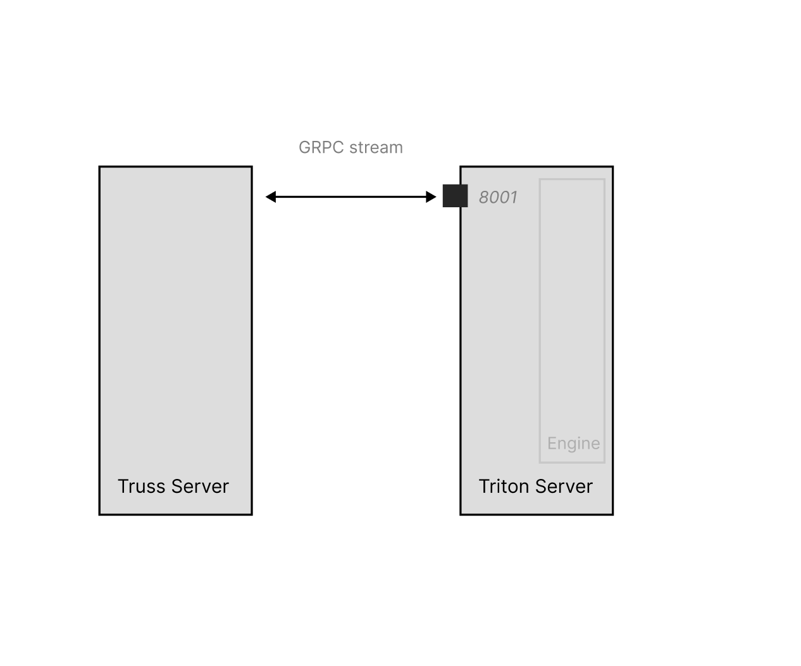

## TRT-LLM Builder Truss

### Introduction
TRT-LLM is high-performance language model inference runtime from Nvidia. To use TRT-LLM on a model, users have to _compile_ a TRT engine from their corresponding PyTorch weights. In this Truss, we provide a config-driven interface to build the engine. We build the engine as part of the server startup and then use Triton Inference Server to serve the engine for high-performance workloads.

NOTE: Building an engine can take a very long time. The approach outlined above is not scalable for fast cold-starts or production workloads where autoscaling may cause multiple replicas to build the engine repeatedly.

### TRT-LLM and Truss
To use `TRT-LLM` in Truss, we provide a key `trt_llm` in the `config.yaml` users can use.
```
trt_llm:
  build:
    base_model_architecture: LLAMA  # Model architecture, e.g. LLAMA, MISTRAL, DEEPSEEK
    max_input_len: 2048  # Maximum input sequence length
    max_output_len: 256  # Maximum output sequence length 
    max_batch_size: 8  # Maximum batch size for inference
    max_beam_width: 4  # Maximum beam width for beam search
    huggingface_ckpt_repository: "decaplusplus/llama-7b-hf" # Path to HuggingFace model checkpoint
    quantization_type: WEIGHTS_KV_INT8 # Quantization type for the engine
    tensor_parallel_count: 1 # Tensor parallelism count
    pipeline_parallel_count: 1 # Pipeline parallelism count
    plugin_configuration:
      multi_block_mode: False  # Enable multi-block mode
      paged_kv_cache: True  # Enable paged KV cache
      use_fused_mlp: False  # Use fused MLP
    
  serve:
    engine_repository: /path/to/engine  # Huggingface repository with TRT engine
    tokenizer_repository: /path/to/tokenizer  # Huggingface repository with TRT engine
    tensor_parallel_count: 1
    pipeline_parallel_count: 1
```

The `build` section specifies the configuration for building the TRT engine from a PyTorch model checkpoint. The required fields are:

- `base_model_architecture`: The model architecture (LLAMA, MISTRAL, DEEPSEEK)
- `max_input_len`: Maximum input sequence length
- `max_output_len`: Maximum output sequence length
- `max_batch_size`: Maximum batch size for inference
- `max_beam_width`: Maximum beam width for beam search
- `huggingface_ckpt_repository`: Path to the HuggingFace model checkpoint with the PyTorch weights

Other optional fields control quantization, parallelism, and plugin settings.

The `serve` section specifies the paths to the compiled TRT engine and tokenizer to use for serving the model. 

Note that build and serve are mutually exclusive - you can only specify one or the other in the config.

### Quantization
One of the features we support is quantization. Quantization is a powerful way to improve latency, TTFT and throughput without significantly dropping the quality performance of the model. We offer the following forms of quantization:

The `quantization_type` field in the `trt_llm` config specifies the quantization method to be used when building the TRT engine:

- `NO_QUANT`: No quantization is applied, and the model runs with full precision (FP32).
- `WEIGHTS_ONLY_INT8`: Only the model weights are quantized to INT8 precision, while activations remain in FP32.
- `WEIGHTS_KV_INT8`: Both the model weights and the key-value cache (used for attention mechanisms) are quantized to INT8.
- `WEIGHTS_ONLY_INT4`: Model weights are quantized to INT4 precision.
- `WEIGHTS_KV_INT4`: Both weights and key-value cache are quantized to INT4.
- `SMOOTH_QUANT`: A quantization technique that smooths the quantized weights to improve accuracy.
- `FP8`: Quantization to FP8 precision (8-bit floating point).
- `FP8_KV`: Both weights and key-value cache are quantized to FP8.

In general, lower precision quantization (e.g., INT4) results in smaller model size and faster inference, but may suffer from more significant accuracy degradation. Higher precision quantization (e.g., INT8, FP8) strikes a better balance between performance and accuracy.

### Serving Architecture


Triton Inference Server operates with protobuf-like inputs. This is highly performant but can result in a difficult user experience. This Truss uses the `TrussServer` to proxy JSON requests over a GRPC stream to the Triton Infernece Server. 

The model repository for Triton is located under the `packages` directory: `packages/tensorrt_llm_model_repository`, In classic TRT-LLM fashion, we run the model as an ensemble of models:
- A `preprocess` model that tokenizes inputs
- A `tensorrt_llm` model that uses the TensorRT-LLM backend for Triton to run your engine. During model startup, we move the engine into `/packages/tensorrt_llm_model_repository/tensorrt_llm/1/`. 
- A `postprocess` model that handles streaming detokenization of tokens produced by the previous model. 

These tokens are streamed to the Truss Server (defined in `model/model.py`) and then streamed to the user. 