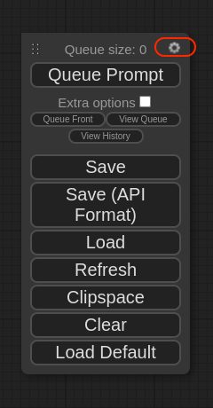
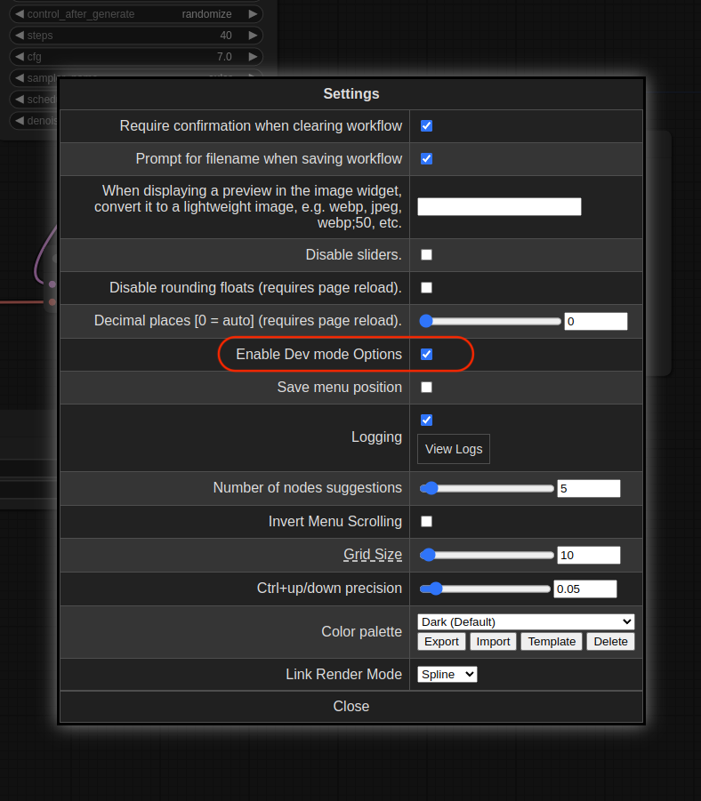
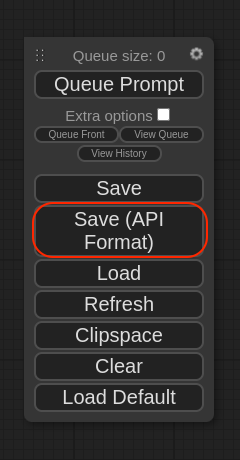

## ComfyUI Truss

This truss is designed to allow ComfyUI users to easily convert their workflows into a production grade API service.

## Exporting the ComfyUI workflow

This Truss is designed to run a Comfy UI workflow that is in the form of a JSON file.

Inside ComfyUI, you can save workflows as a JSON file. However, the regular JSON format that ComfyUI uses will not work. Instead, the workflow has to be saved in the API format. Here is how you can do that:

First, go to ComfyUI and click on the gear icon for the project



Next, checkmark the box which says `Enable Dev Mode Options`



Now, if you go back to the project you will see a new option called `Save (API Format)`. This is the one you want to use to save your workflow. Using this method you can save any ComfyUI workflow as a JSON file in the API format.




## Setting up the project

First, clone this repository:

```sh
git clone https://github.com/basetenlabs/truss-examples/
cd comfyui-truss
```

For your ComfyUI workflow, you probably used one or more models. Those models need to be defined inside truss. From the root of the truss project, open the file called `config.yaml`. In this file we will modify an element called `build_commands`. Build commands will allow you to run docker commands at build time. You can use this feature to download model weights and install custom nodes.

```yaml
build_commands:
- git clone https://github.com/comfyanonymous/ComfyUI.git
- cd ComfyUI && git checkout b1fd26fe9e55163f780bf9e5f56bf9bf5f035c93 && pip install -r requirements.txt
- cd ComfyUI/custom_nodes && git clone https://github.com/LykosAI/ComfyUI-Inference-Core-Nodes --recursive && cd ComfyUI-Inference-Core-Nodes && pip install -e .[cuda12]
- cd ComfyUI/custom_nodes && git clone https://github.com/ZHO-ZHO-ZHO/ComfyUI-Gemini --recursive && cd ComfyUI-Gemini && pip install -r requirements.txt
- cd ComfyUI/custom_nodes && git clone https://github.com/kijai/ComfyUI-Marigold --recursive && cd ComfyUI-Marigold && pip install -r requirements.txt
- cd ComfyUI/custom_nodes && git clone https://github.com/omar92/ComfyUI-QualityOfLifeSuit_Omar92 --recursive
- cd ComfyUI/custom_nodes && git clone https://github.com/Fannovel16/comfyui_controlnet_aux --recursive && cd comfyui_controlnet_aux && pip install -r requirements.txt
- cd ComfyUI/models/controlnet && wget -O control-lora-canny-rank256.safetensors https://huggingface.co/stabilityai/control-lora/resolve/main/control-LoRAs-rank256/control-lora-canny-rank256.safetensors
- cd ComfyUI/models/controlnet && wget -O control-lora-depth-rank256.safetensors https://huggingface.co/stabilityai/control-lora/resolve/main/control-LoRAs-rank256/control-lora-depth-rank256.safetensors
- cd ComfyUI/models/checkpoints && wget -O dreamshaperXL_v21TurboDPMSDE.safetensors https://civitai.com/api/download/models/351306
- cd ComfyUI/models/loras && wget -O StudioGhibli.Redmond-StdGBRRedmAF-StudioGhibli.safetensors https://huggingface.co/artificialguybr/StudioGhibli.Redmond-V2/resolve/main/StudioGhibli.Redmond-StdGBRRedmAF-StudioGhibli.safetensors
environment_variables: {}
external_package_dirs: []
model_metadata: {}
model_name: comfy build commands
python_version: py310
requirements:
  - websocket-client==1.6.4
  - accelerate==0.23.0
  - opencv-python
resources:
  accelerator: A100
  use_gpu: true
secrets: {}
system_packages:
  - wget
  - ffmpeg
  - libgl1-mesa-glx
```

Here is a breakdown of the actions happenning in `build_commands`. First, we are cloning the ComfyUI repository, checking out a specific commit, and installing the required python packages to run ComfyUI. Next, we use the `cd` commmand ensure all custom nodes are downloaded within the `custom_nodes` directory, and their respective requirements are installed. Similarly for the checkpoints, we use the `wget` utility to download the checkpoints and place them in the appropriate directories within ComfyUI.

Every line under `build_commands` effectively does a `RUN` inside the dockerfile. The benefit of using this feature is that your model weights and custom nodes get cached during the docker build stage. So when your model deploys, it can access the cached weights directly which reduces the cold-start time.

We also need to place the JSON workflow from step 1 inside the data directory. In the data directory create an open a file called `data/comfy_ui_workflow.json`. Copy and paste the entire JSON workflow that we saved in step 1 into this file.

In the JSON workflow file, there might be some inputs such as the positive prompt or negative prompt that are hard coded. We want these inputs to be dynamically sent to the model, so we can use handlebars to templatize them. Here is an example of a JSON workflow with templatized inputs:

```json
{
  "6": {
    "inputs": {
      "text": "{{positive_prompt}}",
      "clip": [
        "14",
        1
      ]
    },
    "class_type": "CLIPTextEncode"
  },
  "7": {
    "inputs": {
      "text": "{{negative_prompt}}",
      "clip": [
        "14",
        1
      ]
    },
    "class_type": "CLIPTextEncode"
  },
  "11": {
    "inputs": {
      "image": "{{controlnet_image}}",
      "choose file to upload": "image"
    },
    "class_type": "LoadImage"
  },
  "12": {
    "inputs": {
      "control_net_name": "diffusers_xl_canny_full.safetensors"
    },
    "class_type": "ControlNetLoader"
  },
  "14": {
    "inputs": {
      "ckpt_name": "sd_xl_base_1.0.safetensors"
    },
    "class_type": "CheckpointLoaderSimple"
  },
  "15": {
    "inputs": {
      "images": [
        "16",
        0
      ]
    },
    "class_type": "PreviewImage"
  },
  "18": {
    "inputs": {
      "images": [
        "8",
        0
      ]
    },
    "class_type": "PreviewImage"
  }
}
```

This is not the entire JSON workflow file, but the nodes 6, 7, and 11 accept variable inputs. You can do this by using the handlebars format of `{{variable_name_here}}`.

## Custom Nodes
If your workflow uses custom nodes you add it to the `build_commands` in the `config.yaml` file. Let's take an example. Suppose you want to add the [UltimateSDUpscale](https://github.com/ssitu/ComfyUI_UltimateSDUpscale) custom node. Inside your `config.yaml` you can define it like so:

```yaml
build_commands:
- cd ComfyUI/custom_nodes && git clone https://github.com/ssitu/ComfyUI_UltimateSDUpscale --recursive
```

Each command in `build_commands` is independent of the previous command. So you need to execute this part `cd ComfyUI/custom_nodes` each time you want to install a new custom node.

Once you have both the `data/comfy_ui_workflow.json` and `config.yaml` set up correctly we can begin deployment.

## Deployment

Before deployment:

1. Make sure you have a [Baseten account](https://app.baseten.co/signup) and [API key](https://app.baseten.co/settings/account/api_keys).
2. Install the latest version of Truss: `pip install --upgrade truss`

With `comfyui-truss` as your working directory, you can deploy the model with:

```sh
truss push
```

Paste your Baseten API key if prompted.

For more information, see [Truss documentation](https://truss.baseten.co).

## Model Inference

When an inference request is sent to the Truss, the `comfy_ui_workflow.json` in the data directory is sent to ComfyUI. If you recall, there are some templatized variables inside that json file using the handlebars format of `{{variable_name_here}}`. During inference time, we can dynamically pass in those templatized variables to our Truss prediction request like so:

```python
values = {
  "positive_prompt": "An igloo on a snowy day, 4k, hd",
  "negative_prompt": "blurry, text, low quality",
  "controlnet_image": "https://storage.googleapis.com/logos-bucket-01/baseten_logo.png"
}
```

Just be sure that the variable names in the `comfy_ui_workflow.json` template match the names inside the values object.

Here is a complete example of how you make a prediction request to your truss in python:

This is the content of `data/comfy_ui_workflow.json`:
```json
sdxl_controlnet_workflow = {
  "3": {
    "inputs": {
      "seed": 972197629127129,
      "steps": 40,
      "cfg": 7,
      "sampler_name": "euler",
      "scheduler": "normal",
      "denoise": 1,
      "model": [
        "14",
        0
      ],
      "positive": [
        "10",
        0
      ],
      "negative": [
        "7",
        0
      ],
      "latent_image": [
        "5",
        0
      ]
    },
    "class_type": "KSampler"
  },
  "5": {
    "inputs": {
      "width": 1024,
      "height": 1024,
      "batch_size": 1
    },
    "class_type": "EmptyLatentImage"
  },
  "6": {
    "inputs": {
      "text": "{{positive_prompt}}",
      "clip": [
        "14",
        1
      ]
    },
    "class_type": "CLIPTextEncode"
  },
  "7": {
    "inputs": {
      "text": "{{negative_prompt}}",
      "clip": [
        "14",
        1
      ]
    },
    "class_type": "CLIPTextEncode"
  },
  "8": {
    "inputs": {
      "samples": [
        "3",
        0
      ],
      "vae": [
        "14",
        2
      ]
    },
    "class_type": "VAEDecode"
  },
  "10": {
    "inputs": {
      "strength": 0.6,
      "conditioning": [
        "6",
        0
      ],
      "control_net": [
        "12",
        0
      ],
      "image": [
        "16",
        0
      ]
    },
    "class_type": "ControlNetApply"
  },
  "11": {
    "inputs": {
      "image": "{{controlnet_image}}",
      "choose file to upload": "image"
    },
    "class_type": "LoadImage"
  },
  "12": {
    "inputs": {
      "control_net_name": "diffusers_xl_canny_full.safetensors"
    },
    "class_type": "ControlNetLoader"
  },
  "14": {
    "inputs": {
      "ckpt_name": "sd_xl_base_1.0.safetensors"
    },
    "class_type": "CheckpointLoaderSimple"
  },
  "15": {
    "inputs": {
      "images": [
        "16",
        0
      ]
    },
    "class_type": "PreviewImage"
  },
  "16": {
    "inputs": {
      "low_threshold": 0.2,
      "high_threshold": 0.6,
      "image": [
        "11",
        0
      ]
    },
    "class_type": "Canny"
  },
  "18": {
    "inputs": {
      "images": [
        "8",
        0
      ]
    },
    "class_type": "PreviewImage"
  }
}
```

Here is the actual API request sent to Truss:
```python
import os
import random
import base64
import requests

# Set essential values
model_id = ""
baseten_api_key = ""
# Set prompts and controlnet image
values = {
  "positive_prompt": "A top down view of a river through the woods",
  "negative_prompt": "blurry, text, low quality",
  "controlnet_image": "https://storage.googleapis.com/logos-bucket-01/baseten_logo.png",
  "seed": random.randint(1, 1000000)
}
# Call model endpoint
res = requests.post(
    f"https://model-{model_id}.api.baseten.co/development/predict",
    headers={"Authorization": f"Api-Key {baseten_api_key}"},
    json={"workflow_values": values}
)
# Get output image
res = res.json()
preamble = "data:image/png;base64,"
output = base64.b64decode(res["result"][1]["image"].replace(preamble, ""))
# Save image to file
img_file = open("comfyui.png", 'wb')
img_file.write(output)
img_file.close()
os.system("open comfyui.png")
```

Here is the output of the request above:

```json
[
    {
        "node_id": "18",
        "data": "base64-image-string",
        "format": "png"
    },
    {
        "node_id": "15",
        "data": "base64-image-string",
        "format": "png"
    }
]
```

The output of the model is a list of JSON objects containing the ID of the output node along with the generated image as a base64 string.

You can also send input images as base64 strings. In the above example simply change the `values` python dictionary to look like this:

```python
from PIL import Image
from io import BytesIO
import base64

def pil_to_b64(pil_img):
    buffered = BytesIO()
    pil_img.save(buffered, format="PNG")
    img_str = base64.b64encode(buffered.getvalue()).decode("utf-8")
    return img_str

new_values = {
  "positive_prompt": "A top down view of a river through the woods",
  "negative_prompt": "blurry, text, low quality",
  "controlnet_image": {"type": "image", "data": pil_to_b64(Image.open("my-image.jpeg"))},
  "seed": random.randint(1, 1000000)
}
```

When using base64 as input you need to specify the `type` so that the model can convert it to the correct data.
