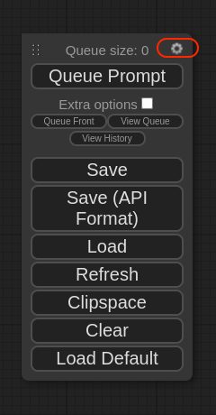
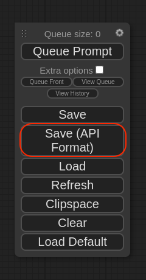

## ComfyUI Truss

This truss is designed to allow ComfyUI users to easily convert their workflows into a production grade API service.

## Exporting the ComfyUI workflow

This Truss is designed to run a Comfy UI workflow that is in the form of a JSON file.

Inside ComfyUI, you can save workflows as a JSON file. However, the regular JSON format that ComfyUI uses will not work. Instead, the workflow has to be saved in the API format. Here is how you can do that:

First, go to ComfyUI and click on the gear icon for the project



Next, checkmark the box which says `Enable Dev Mode Options`


Now, if you go back to the project you will see a new option called `Save (API Format)`. This is the one you want to use to save your workflow. Using this method you can save any ComfyUI workflow as a JSON file in the API format.




## Setting up the project

First, clone this repository:

```sh
git clone https://github.com/basetenlabs/truss-examples/
cd comfyui-truss
```

For your ComfyUI workflow, you probably used one or more models. Those models need to be defined inside truss. From the root of the truss project, create and open the file inside the data directory called `data/model.json`. This file will contain all of the models that need to get downloaded in order for your ComfyUI workflow to run. Here is an example of the contents of this file:

```json
[
    {
        "url": "https://huggingface.co/stabilityai/stable-diffusion-xl-base-1.0/resolve/main/sd_xl_base_1.0.safetensors",
        "path": "checkpoints/sd_xl_base_1.0.safetensors"
    },
    {
        "url": "https://huggingface.co/diffusers/controlnet-canny-sdxl-1.0/resolve/main/diffusion_pytorch_model.fp16.safetensors",
        "path": "controlnet/diffusers_xl_canny_full.safetensors"
    }
]
```

In this case, I have 2 models: SDXL and a ControlNet. Each model needs to have 2 things, `url` and `path`. The `url` is the location for downloading the model. The `path` is where this model will get stored inside the Truss. For the path, follow the same guidelines as used in ComfyUI. Models should get stored inside `checkpoints`, ControlNets should be stored inside `controlnet`, etc.

We also need to place the JSON workflow from step 1 inside the data directory. In the data directory create an open a file called `data/comfy_ui_workflow.json`. Copy and paste the entire JSON workflow that we saved in step 1 into this file.

In the JSON workflow file, there might be some inputs such as the positive prompt or negative prompt that are hard coded. We want these inputs to be dynamically sent to the model, so we can use handlebars to templatize them. Here is an example of a JSON workflow with templatized inputs:

```json
{
  "6": {
    "inputs": {
      "text": "{{positive_prompt}}",
      "clip": [
        "14",
        1
      ]
    },
    "class_type": "CLIPTextEncode"
  },
  "7": {
    "inputs": {
      "text": "{{negative_prompt}}",
      "clip": [
        "14",
        1
      ]
    },
    "class_type": "CLIPTextEncode"
  },
  "11": {
    "inputs": {
      "image": "{{controlnet_image}}",
      "choose file to upload": "image"
    },
    "class_type": "LoadImage"
  },
  "12": {
    "inputs": {
      "control_net_name": "diffusers_xl_canny_full.safetensors"
    },
    "class_type": "ControlNetLoader"
  },
  "14": {
    "inputs": {
      "ckpt_name": "sd_xl_base_1.0.safetensors"
    },
    "class_type": "CheckpointLoaderSimple"
  },
  "15": {
    "inputs": {
      "images": [
        "16",
        0
      ]
    },
    "class_type": "PreviewImage"
  },
  "18": {
    "inputs": {
      "images": [
        "8",
        0
      ]
    },
    "class_type": "PreviewImage"
  }
}
```

This is not the entire JSON workflow file, but the nodes 6, 7, and 11 accept variable inputs. You can do this by using the handlebars format of `{{variable_name_here}}`.

Once you have both the `data/comfy_ui_workflow.json` and `data/model.json` set up correctly we can begin deployment.

## Deployment

Before deployment:

1. Make sure you have a [Baseten account](https://app.baseten.co/signup) and [API key](https://app.baseten.co/settings/account/api_keys).
2. Install the latest version of Truss: `pip install --upgrade truss`

With `comfyui-truss` as your working directory, you can deploy the model with:

```sh
truss push
```

Paste your Baseten API key if prompted.

For more information, see [Truss documentation](https://truss.baseten.co).

## Model Inference

When an inference request is sent to the Truss, the `comfy_ui_workflow.json` in the data directory is sent to ComfyUI. If you recall, there are some templatized variables inside that json file using the handlebars format of `{{variable_name_here}}`. During inference time, we can dynamically pass in those templatized variables to our Truss prediction request like so:

```python
values = {
  "positive_prompt": "An igloo on a snowy day, 4k, hd",
  "negative_prompt": "blurry, text, low quality",
  "controlnet_image": "https://storage.googleapis.com/logos-bucket-01/baseten_logo.png"
}
```

Just be sure that the variable names in the `comfy_ui_workflow.json` template match the names inside the values object.

Here is a complete example of how you make a prediction request to your truss in python:

This is the content of `data/comfy_ui_workflow.json`:
```json
sdxl_controlnet_workflow = {
  "3": {
    "inputs": {
      "seed": 972197629127129,
      "steps": 40,
      "cfg": 7,
      "sampler_name": "euler",
      "scheduler": "normal",
      "denoise": 1,
      "model": [
        "14",
        0
      ],
      "positive": [
        "10",
        0
      ],
      "negative": [
        "7",
        0
      ],
      "latent_image": [
        "5",
        0
      ]
    },
    "class_type": "KSampler"
  },
  "5": {
    "inputs": {
      "width": 1024,
      "height": 1024,
      "batch_size": 1
    },
    "class_type": "EmptyLatentImage"
  },
  "6": {
    "inputs": {
      "text": "{{positive_prompt}}",
      "clip": [
        "14",
        1
      ]
    },
    "class_type": "CLIPTextEncode"
  },
  "7": {
    "inputs": {
      "text": "{{negative_prompt}}",
      "clip": [
        "14",
        1
      ]
    },
    "class_type": "CLIPTextEncode"
  },
  "8": {
    "inputs": {
      "samples": [
        "3",
        0
      ],
      "vae": [
        "14",
        2
      ]
    },
    "class_type": "VAEDecode"
  },
  "10": {
    "inputs": {
      "strength": 0.6,
      "conditioning": [
        "6",
        0
      ],
      "control_net": [
        "12",
        0
      ],
      "image": [
        "16",
        0
      ]
    },
    "class_type": "ControlNetApply"
  },
  "11": {
    "inputs": {
      "image": "{{controlnet_image}}",
      "choose file to upload": "image"
    },
    "class_type": "LoadImage"
  },
  "12": {
    "inputs": {
      "control_net_name": "diffusers_xl_canny_full.safetensors"
    },
    "class_type": "ControlNetLoader"
  },
  "14": {
    "inputs": {
      "ckpt_name": "sd_xl_base_1.0.safetensors"
    },
    "class_type": "CheckpointLoaderSimple"
  },
  "15": {
    "inputs": {
      "images": [
        "16",
        0
      ]
    },
    "class_type": "PreviewImage"
  },
  "16": {
    "inputs": {
      "low_threshold": 0.2,
      "high_threshold": 0.6,
      "image": [
        "11",
        0
      ]
    },
    "class_type": "Canny"
  },
  "18": {
    "inputs": {
      "images": [
        "8",
        0
      ]
    },
    "class_type": "PreviewImage"
  }
}
```

Here is the actual API request sent to Truss:
```python
import random
import base64

# Set essential values
model_id = ""
baseten_api_key = ""
# Set prompts and ControlNet image
values = {
  "positive_prompt": "An illustration of a forest, at sunset, fall colors, 4k, hd",
  "negative_prompt": "blurry, text, low quality",
  "controlnet_image": "https://storage.googleapis.com/logos-bucket-01/baseten_logo.png",
  "seed": random.randint(1, 1000000)
}
# Call model endpoint
res = requests.post(
    f"https://model-{model_id}.api.baseten.co/development/predict",
    headers={"Authorization": f"Api-Key {baseten_api_key}"},
    json={"workflow_values": values}
)
# Get output image
res = res.json()
output = res["result"][1]["image"]
# Save image to file
img_file = open("comfyui.jpeg", 'wb')
img_file.write(img)
img_file.close()
```

Here is the output of the request above:

```json
[
    {
        "node_id": "18",
        "image": "base64-image-string"
    },
    {
        "node_id": "15",
        "image": "base64-image-string"
    }
]
```

The output of the model is a list of JSON objects containing the ID of the output node along with the generated image as a base64 string.
