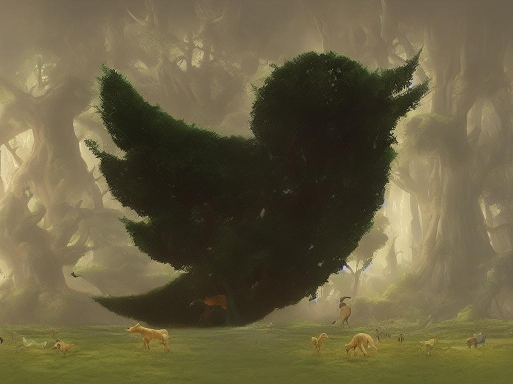

# Control Net QR Code Truss

This truss allows you to generate QR codes using Stable Diffusion and Control Net. By typing in a prompt using the same guidelines as stable diffusion, a new image gets created that combines the image from the prompt with the image of a qr code. For this truss [Stable Diffusion 1.5](https://huggingface.co/runwayml/stable-diffusion-v1-5) is used along with [Control QR Code Monster](https://huggingface.co/monster-labs/control_v1p_sd15_qrcode_monster) as the control net.


## Deployment

First, clone this repository:

```sh
git clone https://github.com/basetenlabs/truss-examples/
cd control-net-qrcode
```

Before deployment:

1. Make sure you have a [Baseten account](https://app.baseten.co/signup) and [API key](https://app.baseten.co/settings/account/api_keys).
2. Install the latest version of Truss: `pip install --upgrade truss`

With `control-net-qrcode` as your working directory, you can deploy the model with:

```sh
truss push
```

Paste your Baseten API key if prompted.

For more information, see [Truss documentation](https://truss.baseten.co).

### Hardware notes

This two models combined only take up about 5 GB of VRAM so a T4 is enough for this truss.

### API route: `predict`

The predict route is the primary method for generating images based on a given prompt. It takes several parameters:

- __prompt__ (required): The input text required for image generation.
- __qr_code_content__ (optional): The URL the QR code points to.
- __mask__ (optional): If a URL is not passed into qr_code_content, a custom image can be used as a mask
- __negative_prompt__ (optional, default=""): Use this to refine the image generation by discarding unwanted items.
- __guidance_scale__ (optional, default=7.5): Used to control image generation.
- __condition_scale__ (optional, default=1.2): The lower the condition_scale, the more creative the results. A higher condition_scale will result in less creative and more scannable QR Codes.
- __sampler__(optional, default="Euler a"): This controls which sampler to use resulting in more image variations.

## Example usage

```sh
truss predict -d '{"prompt": "A cubism painting of the Garden of Eaden with animals walking around, Andreas Rocha, matte painting concept art, a detailed matte painting", "qr_code_content": "https://www.baseten.co"}'
```

You can also invoke your model via a REST API:

```
curl -X POST " https://app.baseten.co/model_versions/YOUR_MODEL_VERSION_ID/predict" \
     -H "Content-Type: application/json" \
     -H 'Authorization: Api-Key {YOUR_API_KEY}' \
     -d '{
           "prompt": "A cubism painting of the Garden of Eaden with animals walking around, Andreas Rocha, matte painting concept art, a detailed matte painting", "qr_code_content": "https://www.baseten.co"
         }'
```

If you want to use a mask instead of a QR code you can call the API like so:
``` python
import requests
import base64
from io import BytesIO
from PIL import Image
BASE64_PREAMBLE = "data:image/png;base64,"

def pil_to_b64(pil_img):
    buffered = BytesIO()
    pil_img.save(buffered, format="PNG")
    img_str = base64.b64encode(buffered.getvalue()).decode("utf-8")
    return img_str

def b64_to_pil(b64_str):
    return Image.open(BytesIO(base64.b64decode(b64_str.replace(BASE64_PREAMBLE, ""))))

input_image = Image.open("image/path/here")
b64_img = pil_to_b64(input_image)
headers = {"Authorization": f"Api-Key YOUR-API-KEY-HERE"}
data = {
  "prompt": "a cubism painting of the Garden of Eaden with animals walking around, Andreas Rocha, matte painting  concept art, a detailed matte painting",
  "mask": b64_img
}
res = requests.post("https://app.baseten.co/model_versions/MODEL_VERSION/predict", headers=headers, json=data)
pil_img = b64_to_pil(output.get("model_output").get("result"))
pil_img.save("output.jpg")
```

Here is the output when using the `twitter_mask.jpeg` as the input image for the mask:



