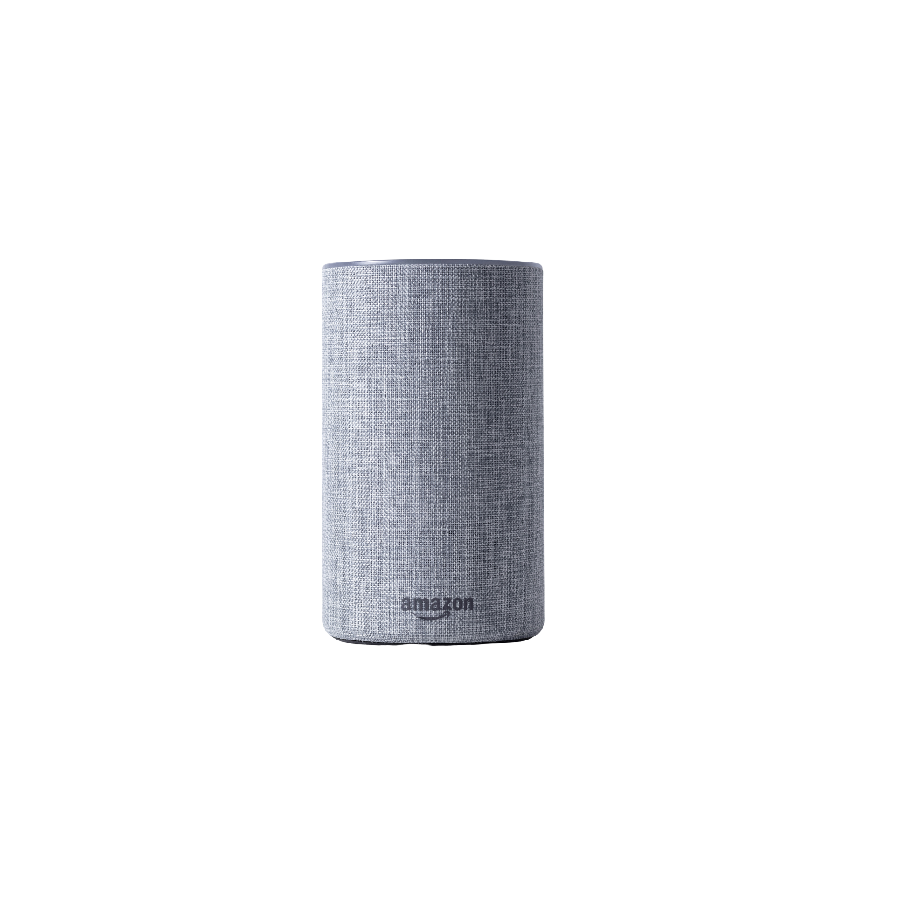
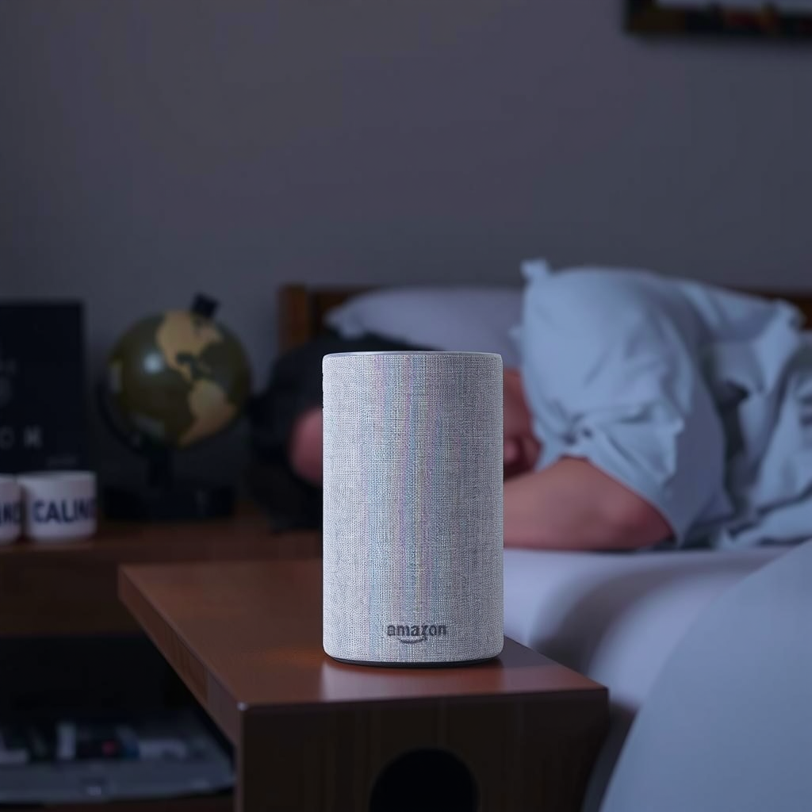

# Fotographer AI ZenCtrl

Image-to-image model for generating in-context product photography.

Deploy with `truss push --promote`

Call with `python call.py` after providing `model_id` from deployed model.

### Example input image

### Example output image

